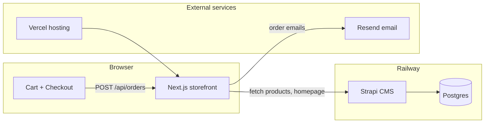

# Mang Crinkle — Project Plan & Phase Tracker

A menu-poster style storefront for **Mang Crinkle** (crinkle cookies, packs, drinks). Customers browse the menu, build a cart, and place pickup orders. Content is managed in Strapi; the Next.js site is the public-facing shop.

**Repo:** [shaygail/mangcrinkle](https://github.com/shaygail/mangcrinkle)

---

## Architecture



| Layer | Tech | Host |
|-------|------|------|
| Storefront | Next.js 16, React 19, Tailwind 4, TypeScript | Vercel (planned) |
| CMS | Strapi v5 + Postgres | Railway |
| Orders | Resend (transactional email) | Resend |
| Cart persistence | `localStorage` | Client |

---

## What's built today

- **Homepage** — hero, story, fan favourites, recipes/how-to-order, testimonials, CTA (CMS-driven with fallbacks)
- **Shop** — full menu, crinkle packs with flavour picker, drinks with milk options, merch grid
- **Cart** — add/edit/remove, pack flavour edits, milk swaps, subtotal, drawer UI
- **Checkout** — customer form + order API (email sending pending Resend config)
- **CMS** — products, homepage single type, testimonials, order steps
- **Fallbacks** — site works if Strapi is unreachable

---

## Phase tracker

| Phase | Focus | Status |
|-------|--------|--------|
| **1** | Storefront & cart | ✅ Complete |
| **2** | Strapi CMS + content | ✅ Complete |
| **3** | Tie it all together (go-live) | 🔲 Not started |
| **4+** | Future enhancements | 📋 Backlog |

Update checkboxes below as work progresses.

---

## Phase 1 — Storefront & cart

**Goal:** A working shop customers can browse and add items to.

- [x] Next.js App Router site with menu-poster design
- [x] Product catalogue helpers (`src/data/products.ts`)
- [x] Shop page with categories (crinkles, packs, lava, drinks, merch)
- [x] Crinkle pack customizer (pick flavours, upgrade pricing)
- [x] Drink alt-milk options (+$1)
- [x] Cart context + `localStorage` persistence
- [x] Cart drawer (quantity, remove, pack/milk edits)
- [x] Add-to-cart flows (cards, fan favourites, pack form)
- [x] Typography & 3D button polish
- [x] Placeholder images for products without uploads

**Key files:** `src/app/shop/page.tsx`, `src/context/CartContext.tsx`, `src/lib/cart.ts`, `src/components/CartDrawer.tsx`

---

## Phase 2 — Strapi CMS + order emails

**Goal:** Edit menu and homepage copy in Strapi; receive orders by email.

### CMS (done)

- [x] Strapi on Railway (`strapi/` subfolder, Postgres)
- [x] Content types: **Product**, **Homepage**, **Testimonial**, **Order Step**
- [x] Public read permissions (bootstrap)
- [x] Next.js fetch layer with 60s revalidate + fallbacks (`src/lib/strapi.ts`)
- [x] Seed scripts: `scripts/seed-strapi.ts`, `scripts/seed-homepage.ts`
- [x] Homepage components wired to CMS props
- [x] Railway monorepo config (Next.js root `/`, Strapi root `strapi/`)

### Order emails (code done — config deferred)

- [x] `POST /api/orders` with server-side price validation
- [x] Checkout form in cart drawer (`CheckoutForm.tsx`)
- [x] Resend integration (`src/lib/email.ts`)
- [x] Owner notification + customer confirmation emails
- [ ] Resend account + API key
- [ ] Env vars on local + production
- [ ] Domain verified in Resend (production sender)
- [ ] Test order end-to-end

**Env vars (when ready):**

```env
RESEND_API_KEY=re_xxxxxxxx
ORDER_EMAIL_TO=you@mangcrinkle.com
ORDER_EMAIL_FROM=Mang Crinkle <orders@mangcrinkle.com>
```

See `.env.local.example` for the full list (Strapi + Resend).

**Key files:** `src/lib/strapi.ts`, `src/app/api/orders/route.ts`, `src/lib/order.ts`, `src/lib/email.ts`, `strapi/src/api/`

---

## Phase 3 — Tie it all together (go-live)

**Goal:** Connect every piece, deploy, populate content, and launch a site you can run orders on.

### Deployment

- [ ] Deploy Next.js to **Vercel** (connect GitHub repo)
- [ ] Set Vercel env vars: `STRAPI_URL`, `STRAPI_API_TOKEN`, `RESEND_*`, `ORDER_EMAIL_*`
- [ ] Confirm Strapi on Railway is healthy (`/admin`)
- [ ] Confirm Next.js build passes in CI (`npm run build`)
- [ ] Custom domain pointed at Vercel (if applicable)

### Resend (orders)

- [ ] Create Resend account
- [ ] Add API key to Vercel + `.env.local`
- [ ] Test with `onboarding@resend.dev` sender
- [ ] Verify domain for production `ORDER_EMAIL_FROM`
- [ ] Place test order → confirm owner + customer emails arrive

### Strapi content

- [ ] Upload product images in Strapi Admin
- [ ] Upload homepage images (hero, story, CTA background)
- [ ] Review/edit homepage copy, testimonials, order steps
- [ ] Confirm public API returns expected JSON (`/api/products`, `/api/homepage?populate=*`)

### Site QA

- [ ] Homepage loads CMS content (not fallbacks)
- [ ] Shop shows all products with correct prices
- [ ] Pack customizer → add to cart → checkout flow works
- [ ] Drink milk swap updates price correctly
- [ ] Mobile layout (header, cart drawer, shop grid)
- [ ] Empty cart / error states behave correctly

### Polish (optional before launch)

- [ ] Replace any remaining placeholder images
- [ ] Footer/header links & social URLs
- [ ] Favicon + OG meta for sharing
- [ ] Announcement bar copy for launch

---

## Phase 4+ — Backlog (future)

Not scheduled — add here when ready.

- [ ] **Payments** — Stripe or similar (online pay before pickup)
- [ ] **Global settings in CMS** — header, footer, nav, social links
- [ ] **Order storage** — Strapi Order content type or database log (not just email)
- [ ] **Admin order dashboard** — view/filter orders in Strapi or separate admin
- [ ] **Pickup time slots** — scheduled pickup windows
- [ ] **Analytics** — Vercel Analytics or Plausible
- [ ] **Merch CMS** — manage merch items separately if catalogue grows

---

## Environment variables

| Variable | Service | Required for |
|----------|---------|--------------|
| `STRAPI_URL` | Next.js | CMS data |
| `STRAPI_API_TOKEN` | Next.js | Authenticated Strapi reads (optional if public APIs open) |
| `RESEND_API_KEY` | Next.js | Sending order emails |
| `ORDER_EMAIL_TO` | Next.js | Inbox that receives orders |
| `ORDER_EMAIL_FROM` | Next.js | Verified sender address in Resend |

Copy from `.env.local.example`. Never commit `.env.local`.

---

## Useful commands

```bash
# Local dev
npm run dev

# Production build
npm run build

# Seed Strapi (needs STRAPI_URL + STRAPI_API_TOKEN in .env.local)
npx tsx scripts/seed-strapi.ts
npx tsx scripts/seed-homepage.ts
```

**Railway services:**

| Service | Root directory | Healthcheck |
|---------|----------------|-------------|
| Next.js | `/` | `/` |
| Strapi | `strapi` | `/admin` |

**Strapi URL (production):** `https://strapi-production-2a0b.up.railway.app`

---

## Key paths

| Path | Purpose |
|------|---------|
| `src/app/` | Pages (home, shop) |
| `src/app/api/orders/` | Order submission API |
| `src/components/` | UI components |
| `src/context/` | Products + cart providers |
| `src/lib/strapi.ts` | CMS fetch helpers |
| `src/lib/cart.ts` | Pricing, packs, milk logic |
| `src/data/products.ts` | Fallback product catalogue |
| `src/data/homepage.ts` | Fallback homepage content |
| `strapi/src/api/` | Strapi content-type schemas |
| `scripts/` | Seed scripts |

---

## Changelog (high level)

| When | Milestone |
|------|-----------|
| Phase 1 | Storefront, shop, cart |
| Phase 2a | Strapi CMS + homepage wiring |
| Phase 2b | Order checkout + Resend (code only) |
| Phase 3 | *Go-live — in progress when checklist above is started* |

---

*Last updated: July 2026 — update this file as phases complete.*
